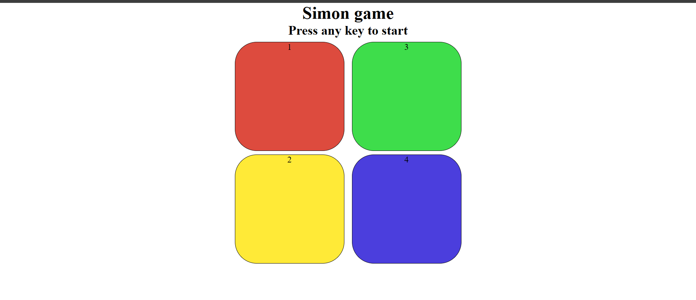
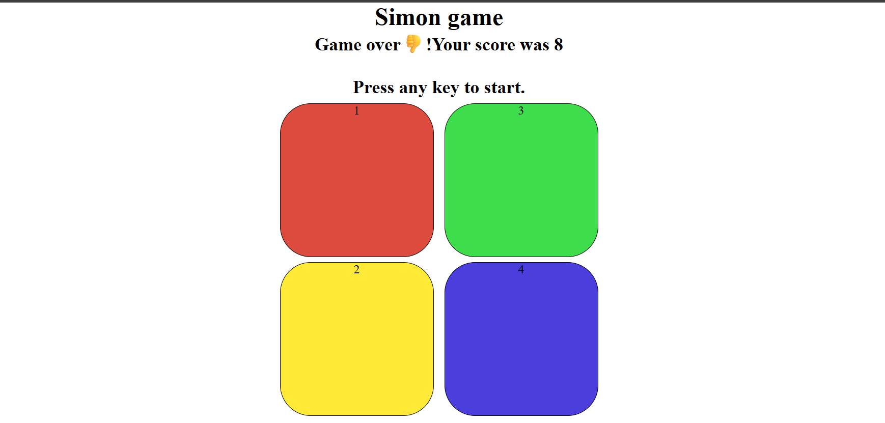

## 🎮 How to Play
1. Press **Start** to begin the game.  
2. Watch the sequence of flashing buttons.  
3. Repeat the sequence in the correct order.  
4. Each round adds one more step.  
5. Make a mistake and the game ends!

## 👨‍💻 Tech Stack
- **HTML5**  
- **CSS3**  
- **JavaScript**

## 📸 Screenshot

